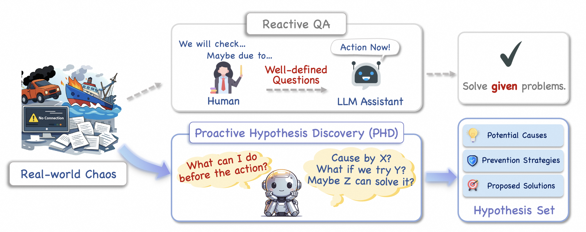
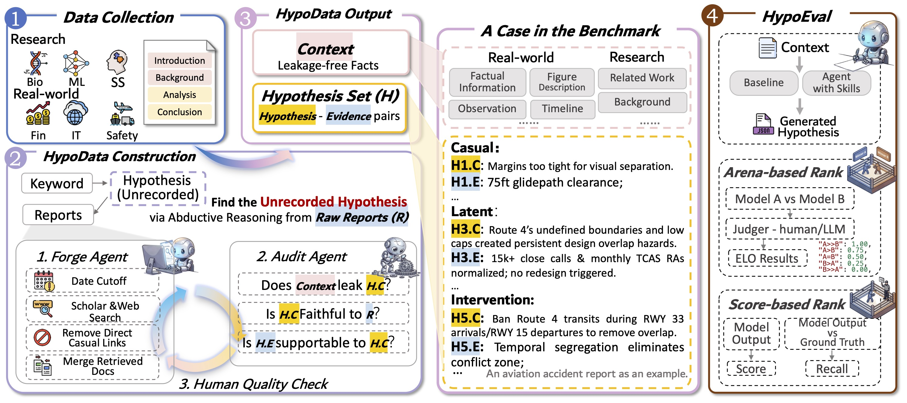

# Before the Action: Benchmarking LLMs on Prospective Hypothesis Discovery

Benchmarking **Prospective Hypothesis Discovery (PHD)** — the open-ended, *pre-conclusion*
stage of discovery where a model must construct a plausible hypothesis space from
inconclusive initial facts, rather than answer a well-defined question.

📄 Paper: *Before the Action: Benchmarking LLMs on Prospective Hypothesis Discovery*
🤗 Dataset: [HypoArena/HypoData](https://huggingface.co/datasets/HypoArena/HypoData)



Unlike **Reactive QA**, where a model answers well-defined questions, **Proactive
Hypothesis Discovery (PHD)** asks a model to confront real-world chaos and proactively
propose a structured hypothesis set — potential causes, prevention strategies, and
proposed solutions — *before* the question is even posed.

## Overview

**HypoArena** evaluates whether language models can generate grounded, non-trivial, and
supportable hypotheses from long, heterogeneous, pre-conclusion source materials. It has
two components:



- **HypoData** — A cross-domain benchmark of **988 cases across six domains**, each
  containing a model-visible Context, a target Hypothesis, and domain-specific supporting
  Evidence. Cases are built by *Retrospective Context Regression*: reverse-engineering
  expert documents into conclusion-free discovery contexts, removing hindsight bias.
- **HypoEval** — An evaluation framework with two systems (**arena** and **score**), both
  built on a shared rubric of quality dimensions.

### 📊 Statistics and source overview of HypoData

| Category | Domain | Source Type | Cases |
|----------|--------|-------------|-------|
| Research | Biomedical Science | Journal Articles | 244 |
| Research | Machine Learning | Conference Papers | 218 |
| Research | Social Science | Journal Articles | 163 |
| Real-World | Financial Analysis | 10-Q Filings | 114 |
| Real-World | IT Operations | Post-mortem Reports | 146 |
| Real-World | Safety Investigation | Investigation Reports | 103 |
| | | **Total** | **988** |

Research domains yield focused, single-direction hypotheses; real-world domains yield
multi-directional hypothesis sets.

## Pipeline

```
Source Documents ─> Construction ─> Generation ─> Evaluation
                    (C, H, E)       (Baseline /    (Arena /
                                     Agent Mode)    Score)
```

### 1. Construction

Builds benchmark instances as (Context, Hypothesis, Evidence) tuples from source materials
through a two-stage Forge–Audit loop:

- **Stage 1**: Context reconstruction with leakage control and temporal consistency
- **Stage 2**: Hypothesis and evidence extraction with iterative quality auditing

Each stage runs a Forge / Audit agent cycle for up to N revision rounds.

### 2. Generation

Produces hypothesis submissions from benchmark contexts in two modes:

- **Baseline Mode**: Direct single-pass inference
- **Agent Mode**: Autonomous selection of structured analytic skills (ACH, brainstorming,
  chronology, cross-impact matrix, pre-mortem, red-hat, etc.) composed into a sequential
  pipeline. See `generation/skills/`.

### 3. Evaluation

Two evaluation systems built on a shared rubric:

- **Arena** — Pairwise preference judgment. Each comparison is run bidirectionally
  (swap A/B) to debias position effects, then aggregated via the Bradley–Terry–Davidson
  model into a global ranking. Position-bias consistency rates are tracked per run.
- **Score** — Per-dimension absolute scoring (1–5) on each rubric dimension, providing
  fine-grained diagnostic signals.

#### Shared Rubric Dimensions

| Level | Dimension | Description |
|-------|-----------|-------------|
| Pair | Grounding | Anchored in context facts and tensions |
| Pair | Insightful | Beyond surface restatement |
| Pair | Justification | Evidence is concrete and adequate |
| Set | Breadth | Addresses distinct factual threads and tensions |
| Set | Distinctness | No duplication across candidates |
| Set | Utility | Useful for downstream analysis |

## Repository Layout

```
basics/          Foundation layer: model registry, platform transport, IO, schemas
construction/    Stage-1/2 Forge–Audit agents and prompts
generation/      Baseline + agent generation; generation/skills/ holds the analytic skills
evaluation/      Arena + score judging and leaderboard aggregation
orchestrator/    End-to-end pipeline coordination
scripts/         CLI entry points (run_*.py) and paper/table builders
tests/           Test suite
```

## Setup

Requires Python >= 3.10. Install with [uv](https://docs.astral.sh/uv/):

```bash
uv sync
```

Configure at least one OpenAI-compatible platform. Copy `.env.example` to `.env` and fill
in the keys/URLs (the runtime falls back to the next available platform on failure):

```bash
cp .env.example .env
```

Map the placeholder platform names (`platform_a` … `platform_d`) and model IDs in
`basics/models.py` to the providers you use.

> **Data.** The benchmark data (`artifacts/`) and generated results are released
> separately via [🤗 HypoArena/HypoData](https://huggingface.co/datasets/HypoArena/HypoData)
> and are not tracked in this repository.

## Usage

Each stage has a standalone runner under `scripts/`; `orchestrate.bash` runs the full
pipeline end-to-end.

### Construction

```bash
uv run python scripts/run_construct.py --domain biomedical_science --profile gpt-5.4-high
```

### Generation

```bash
# Baseline mode
uv run python scripts/run_generate.py --domain biomedical_science \
    --construction-profile gpt-5.4 --profile claude-opus-4.6-high --mode baseline

# Agent mode (autonomous skill selection)
uv run python scripts/run_generate.py --domain safety_investigation \
    --construction-profile gpt-5.4 --profile gpt-5.4-high --mode agent
```

### Evaluation

```bash
# Arena + score with a judge model
uv run python scripts/run_evaluate.py --domain biomedical_science \
    --construction-profile gpt-5.4 --judge mimo-v2-pro --method both
```

### Full pipeline

```bash
bash orchestrate.bash          # edit the config block at the top first
```

## Citation

```bibtex
@misc{hypoarena2026,
  title         = {Before the Action: Benchmarking LLMs on Prospective Hypothesis Discovery},
  author        = {Zhong, Tianyun and Jiang, Wangyi and Wang, Wei and Chen, Xuanang and Lu, Yaojie and Ye, Shiwei and Shi, Yuzhen and Yang, Boyu and Wang, Jinghang and Li, Han and Zhai, Weiqi and Xu, Ze and Wei, Hu and Yu, Haiyang and Li, Yongbin and Lin, Hongyu and Sun, Le and Han, Xianpei},
  year          = {2026},
  eprint        = {XXXX.XXXXX},
  archivePrefix = {arXiv},
  primaryClass  = {cs.CL}
}
```
